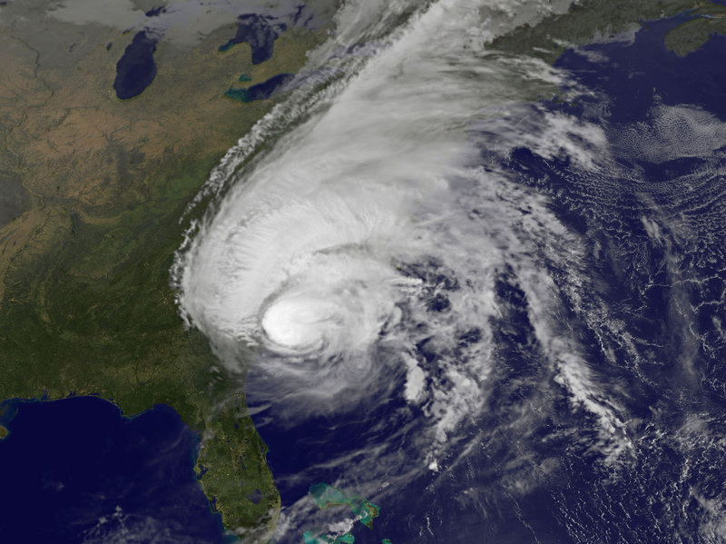

## About FL ASGS

ADCIRC Surge Guidance System (ASGS) run for Eastern Florida

## Computational Resource

North America Meso-scale (NAM) model run on machine Pelican on 24 nodes 2 cycles per day

Tropical Cyclone run on machine Coconut on 48 nodes during existance of active storm(s) in Atlantic Basin

## Reference

Peyman Taeb, Rober J Weaver

